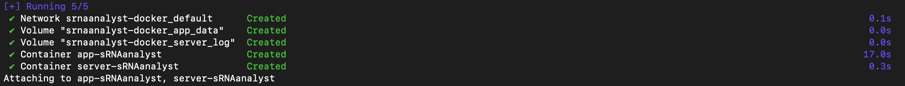
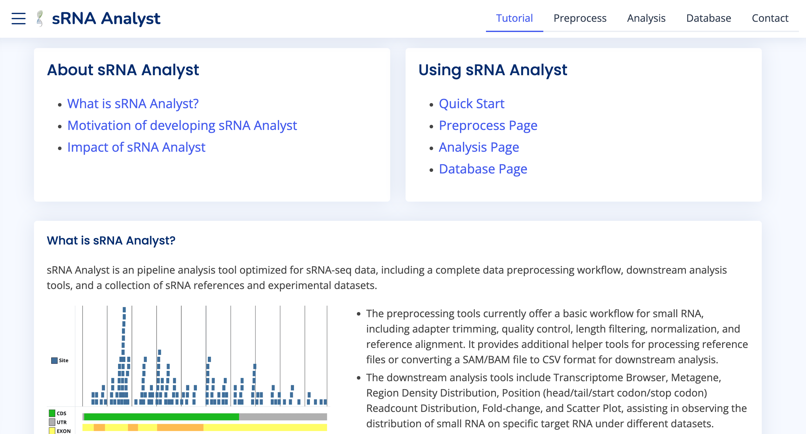

# sRNAanalyst-docker

A dockerized version of sRNAanalyst web tool. To see the original project, please refer to the [GitHub Repository](https://github.com/RyanCCJ/sRNAanalyst), which is a tool for in-depth analysis of sRNA-seq data across conditions and target genes.

> [!NOTE]  
> The Docker version removes the `Database` functionality to reduce file size. If you want to view our literature data and the Target list, please refer to the original [web tool](https://cosbi7.ee.ncku.edu.tw/sRNAanalyst).

## Download and Usage:

1. **Install Docker:**

- For `Windows` platform, please check the [document](https://docs.docker.com/desktop/install/windows-install/).
- For `Mac` platform, please check the [document](https://docs.docker.com/desktop/install/mac-install/).
- For `Linux` platform, please check the [document](https://docs.docker.com/desktop/install/linux-install/).

2. **Download this GitHub Repository:**

Open a terminal or command prompt, clone or download this GitHub repository to your local path:
```
$ git clone https://github.com/RyanCCJ/sRNAanalyst-docker.git
```

3. **Run Docker Container:**

Navigate to the downloaded folder and run the following command:
```
$ docker-compose up
```

During the first execution, all necessary tools and associated packages will be automatically installed, requiring approximately `10 minutes`. Subsequent executions will directly start the container. If you see the following message, it indicates that the tool has been successfully  launched.  



4. **Access the Tool:**

Once the Docker container is running, open a web browser and enter the URL `localhost/sRNAanalyst`. You can now use sRNAanalyst within your browser.



For each subsequent execution, previous analysis results will be automatically saved. Users can log in at any time using their User ID and return to the previous state.

### Shut Down

To shut down the Docker container, you can simply press `Ctrl + C` in the terminal where the container is running. Alternatively, you can use other methods such as running the container in detached mode (`-d` flag), in which case you would need to use the `docker-compose down` command to stop it.

### Find User ID

To find the User ID for a specific login session, follow these steps:
1. Open a terminal.
2. Run the following command to list all running Docker containers and find the container ID corresponding to the `srnaanalyst-docker-app` image:
```
$ docker ps
```
3. Once you have the container ID, run the following command to view the logs and grep for the "User ID" information:
```
$ docker logs --timestamps <Container ID> 2>&1 | grep "User ID"
```

### Managing Disk Space:

Using this tool may generate a large number of data and occupy disk space. You can check the data path for Docker volumes by running the following command:
```
$ docker inspect srnaanalyst-docker_app_data
```
Each computation result will be stored in the `app/media/<User ID>/` directory within the Docker volume. Alternatively, you can use the following command to shut down the container and remove all contents:
```
$ docker-compose down -v
```

## LICENSE
Please refer to our [MIT license](https://github.com/RyanCCJ/sRNAanalyst-docker/blob/master/LICENSE).
